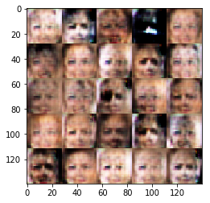
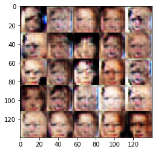
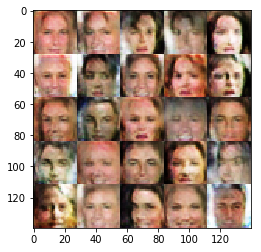
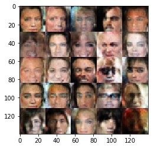
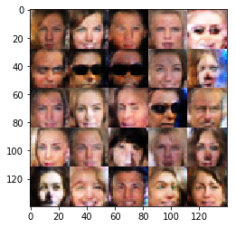

# Face Generation
In this project, we'll use generative adversarial networks to generate new images of faces.
### Get the Data
We'll be using two datasets in this project:
- MNIST
- CelebA

Since the celebA dataset is complex we want 
to first test the neural network on MNIST before CelebA.  Running the GANs on MNIST allows us to see how well the model trains sooner.


```python
data_dir = 'data'
!pip install matplotlib==2.0.2
# FloydHub - Use with data ID "R5KrjnANiKVhLWAkpXhNBe"
#data_dir = '/input'

import helper

helper.download_extract('mnist', data_dir)
helper.download_extract('celeba', data_dir)
```

    Collecting matplotlib==2.0.2
      Using cached https://files.pythonhosted.org/packages/2c/69/362c0a5eca37225c7d451e6c57f07c4fee85a5b6cb3aedf16fe649f411ea/matplotlib-2.0.2-cp27-cp27mu-manylinux1_x86_64.whl
    Requirement already satisfied: subprocess32 in /usr/local/lib/python2.7/dist-packages (from matplotlib==2.0.2) (3.2.7)
    Requirement already satisfied: pyparsing!=2.0.4,!=2.1.2,!=2.1.6,>=1.5.6 in /usr/local/lib/python2.7/dist-packages (from matplotlib==2.0.2) (2.2.0)
    Requirement already satisfied: pytz in /usr/local/lib/python2.7/dist-packages (from matplotlib==2.0.2) (2017.2)
    Requirement already satisfied: six>=1.10 in /usr/local/lib/python2.7/dist-packages (from matplotlib==2.0.2) (1.11.0)
    Requirement already satisfied: functools32 in /usr/local/lib/python2.7/dist-packages (from matplotlib==2.0.2) (3.2.3.post2)
    Requirement already satisfied: python-dateutil in /usr/local/lib/python2.7/dist-packages (from matplotlib==2.0.2) (1.5)
    Requirement already satisfied: cycler>=0.10 in /usr/local/lib/python2.7/dist-packages (from matplotlib==2.0.2) (0.10.0)
    Requirement already satisfied: numpy>=1.7.1 in /usr/local/lib/python2.7/dist-packages (from matplotlib==2.0.2) (1.13.3)
    Installing collected packages: matplotlib
      Found existing installation: matplotlib 2.1.0
        Uninstalling matplotlib-2.1.0:
    Could not install packages due to an EnvironmentError: [Errno 13] Permission denied: '/usr/local/lib/python2.7/dist-packages/matplotlib-2.1.0-py2.7-nspkg.pth'
    Consider using the `--user` option or check the permissions.
    
    Found mnist Data
    Found celeba Data


## Explore the Data
### MNIST
We know that the [MNIST](http://yann.lecun.com/exdb/mnist/) dataset contains images of handwritten digits. We can view the first number of examples by changing `show_n_images`. 


```python
show_n_images = 25

%matplotlib inline
import os
from glob import glob
from matplotlib import pyplot

mnist_images = helper.get_batch(glob(os.path.join(data_dir, 'mnist/*.jpg'))[:show_n_images], 28, 28, 'L')
pyplot.imshow(helper.images_square_grid(mnist_images, 'L'), cmap='gray')
```


    <matplotlib.image.AxesImage at 0x7f0611d47160>


### CelebA
The [CelebFaces Attributes Dataset (CelebA)](http://mmlab.ie.cuhk.edu.hk/projects/CelebA.html) dataset contains over 200,000 celebrity images with annotations.  Since we're going to be generating faces, we won't need the annotations.  We can view the first number of examples by changing `show_n_images`.


```python
show_n_images = 25

mnist_images = helper.get_batch(glob(os.path.join(data_dir, 'img_align_celeba/*.jpg'))[:show_n_images], 28, 28, 'RGB')
pyplot.imshow(helper.images_square_grid(mnist_images, 'RGB'))
```


    <matplotlib.image.AxesImage at 0x7f0611c76978>


## Preprocess the Data
The values of the MNIST and CelebA dataset will be in the range of -0.5 to 0.5 of 28x28 dimensional images.  The CelebA images will be cropped to remove parts of the image that don't include a face, then resized down to 28x28.

The MNIST images are black and white images with a single [color channel](https://en.wikipedia.org/wiki/Channel_(digital_image%29) while the CelebA images have [3 color channels (RGB color channel)](https://en.wikipedia.org/wiki/Channel_(digital_image%29#RGB_Images).
## Build the Neural Network
We'll build the components necessary to build a GANs by implementing the following functions below:
- `model_inputs`
- `discriminator`
- `generator`
- `model_loss`
- `model_opt`
- `train`

### Check the Version of TensorFlow and Access to GPU
This will check to make sure we have the correct version of TensorFlow and access to a GPU


```python
from distutils.version import LooseVersion
import warnings
import tensorflow as tf

# Check TensorFlow Version
assert LooseVersion(tf.__version__) >= LooseVersion('1.0'), 'Please use TensorFlow version 1.0 or newer.  You are using {}'.format(tf.__version__)
print('TensorFlow Version: {}'.format(tf.__version__))

# Check for a GPU
if not tf.test.gpu_device_name():
    warnings.warn('No GPU found. Please use a GPU to train your neural network.')
else:
    print('Default GPU Device: {}'.format(tf.test.gpu_device_name()))
```

    TensorFlow Version: 1.0.0
    Default GPU Device: /gpu:0


### Input
Implemented the `model_inputs` function to create TF Placeholders for the Neural Network. It creates the following placeholders:
- Real input images placeholder with rank 4 using `image_width`, `image_height`, and `image_channels`.
- Z input placeholder with rank 2 using `z_dim`.
- Learning rate placeholder with rank 0.

Return the placeholders in the following the tuple (tensor of real input images, tensor of z data)


```python
import problem_unittests as tests

def model_inputs(image_width, image_height, image_channels, z_dim):
    """
    Create the model inputs
    :param image_width: The input image width
    :param image_height: The input image height
    :param image_channels: The number of image channels
    :param z_dim: The dimension of Z
    :return: Tuple of (tensor of real input images, tensor of z data, learning rate)
    """
    inputs = tf.placeholder(tf.float32, shape=(None, image_width, image_height, image_channels), name='real_input')
    z_inputs = tf.placeholder(tf.float32, shape=(None, z_dim), name='z_input')
    learning_rate = tf.placeholder(tf.float32, name='learning_rate')
    return (inputs,z_inputs, learning_rate)

tests.test_model_inputs(model_inputs)
```

    Tests Passed


### Discriminator
Implemented `discriminator` to create a discriminator neural network that discriminates on `images`.  This function will be able to reuse the variables in the neural network. Used [`tf.variable_scope`](https://www.tensorflow.org/api_docs/python/tf/variable_scope) with a scope name of "discriminator" to allow the variables to be reused.  The function returns a tuple of (tensor output of the discriminator, tensor logits of the discriminator).


```python
def discriminator(images, reuse=False):
    """
    Create the discriminator network
    :param images: Tensor of input image(s)
    :param reuse: Boolean if the weights should be reused
    :return: Tuple of (tensor output of the discriminator, tensor logits of the discriminator)
    """
    alpha = 0.2
    keep_prob = 0.5
    with tf.variable_scope('discriminator',reuse=reuse):
        #input layer is 28*28*3
#         print(images.shape)
        x1 = tf.layers.conv2d(images, 64, 5, strides= 1, padding='valid')
        relu1 = tf.maximum(alpha*x1, x1)
#         print(x1.shape)
        # 24*24*64
        
        x2 = tf.layers.conv2d(relu1, 128, 5, strides=2, padding='same',
                              kernel_initializer=tf.contrib.layers.xavier_initializer())
        x2 = tf.layers.batch_normalization(x2, training=True)
        x2 = tf.layers.dropout(x2, rate=keep_prob)
        relu2 = tf.maximum(alpha*x2, x2)        
        #12*12*128
#         print(x2.shape)
        
        x3 = tf.layers.conv2d(relu2, 256, 5, strides=2, padding='same',
                             kernel_initializer=tf.contrib.layers.xavier_initializer())
        x3 = tf.layers.batch_normalization(x3, training=True)
        x3 = tf.layers.dropout(x3, rate=keep_prob)
        relu3 = tf.maximum(alpha * x3, x3)
#         print(x3.shape)
        #6*6*256
        
        x4 = tf.layers.conv2d(relu3, 512, 5, strides=2, padding='same',
                             kernel_initializer=tf.contrib.layers.xavier_initializer())
        x4 = tf.layers.batch_normalization(x4, training=True)
        x4 = tf.layers.dropout(x4, rate=keep_prob)
        relu4 = tf.maximum(alpha * x4, x4)
#         print(x4.shape)
        #3*3*512
        
        flat = tf.reshape(relu4,(-1, 3*3*512))
#         print(flat.shape)
        logits= tf.layers.dense(flat,1)
        output = tf.sigmoid(logits)
        return (output, logits)

tests.test_discriminator(discriminator, tf)
```

    Tests Passed


### Generator
Implemented `generator` to generate an image using `z`. This function will be able to reuse the variables in the neural network.  Use [`tf.variable_scope`](https://www.tensorflow.org/api_docs/python/tf/variable_scope) with a scope name of "generator" to allow the variables to be reused. The function will return the generated 28 x 28 x `out_channel_dim` images.


```python
def generator(z, out_channel_dim, is_train=True):
    """
    Create the generator network
    :param z: Input z
    :param out_channel_dim: The number of channels in the output image
    :param is_train: Boolean if generator is being used for training
    :return: The tensor output of the generator
    """
    alpha = 0.2
    keep_prob = 0.5
    with tf.variable_scope('generator', reuse=(not is_train)):
        x1 = tf.layers.dense(z, 3*3*512)
#         print(x1.shape)
        x1 = tf.reshape(x1, (-1 , 3, 3, 512))
        x1 = tf.layers.batch_normalization(x1, training=is_train)
        x1 = tf.maximum(alpha * x1, x1)
        x1 = tf.layers.dropout(x1, rate=keep_prob)
#         print(x1.shape)
        #3*3*512
        
        x2 = tf.layers.conv2d_transpose(x1, 256, 5, strides=2, padding='same')
        x2 = tf.layers.batch_normalization(x2, training=is_train)
        x2 = tf.maximum(alpha*x2 , x2)
        x1 = tf.layers.dropout(x2, rate=keep_prob)
#         print(x2.shape)
        #6*6*256
        
        x3 = tf.layers.conv2d_transpose(x2, 128, 5, strides=2, padding='same')
        x3 = tf.layers.batch_normalization(x3, training=is_train)
        x3 = tf.maximum(alpha*x3,x3)
        x1 = tf.layers.dropout(x3, rate=keep_prob)
#         print(x3.shape)
        #12*12*128

        x4 = tf.layers.conv2d_transpose(x3, 64, 5, strides=2, padding='same')
        x4 = tf.layers.batch_normalization(x4, training=is_train)
        x4 = tf.maximum(alpha*x4,x4)
#         x1 = tf.layers.dropput(x4, rate=keep_prob)
#         print(x4.shape)
        #24*24*64
        
        logits = tf.layers.conv2d_transpose(x4, out_channel_dim, 5, strides=1, padding='valid')
#         print(logits.shape)
        #28*28*5
        output = tf.tanh(logits)    
        return output

tests.test_generator(generator, tf)
```

    Tests Passed


### Loss
Implementex `model_loss` to build the GANs for training and calculate the loss.  The function returns a tuple of (discriminator loss, generator loss).  Used the following functions we implemented earlier:
- `discriminator(images, reuse=False)`
- `generator(z, out_channel_dim, is_train=True)`


```python
def model_loss(input_real, input_z, out_channel_dim):
    """
    Get the loss for the discriminator and generator
    :param input_real: Images from the real dataset
    :param input_z: Z input
    :param out_channel_dim: The number of channels in the output image
    :return: A tuple of (discriminator loss, generator loss)
    """
    smooth = 0.9
    g_model = generator(input_z, out_channel_dim)
    d_model_real, d_logits_real = discriminator(input_real)
    d_model_fake, d_logits_fake = discriminator(g_model, reuse=True)

    d_loss_real = tf.reduce_mean(
        tf.nn.sigmoid_cross_entropy_with_logits(logits=d_logits_real, labels=tf.ones_like(d_model_real)*smooth))
    d_loss_fake = tf.reduce_mean(
        tf.nn.sigmoid_cross_entropy_with_logits(logits=d_logits_fake, labels=tf.zeros_like(d_model_fake)))
    g_loss = tf.reduce_mean(
        tf.nn.sigmoid_cross_entropy_with_logits(logits=d_logits_fake, labels=tf.ones_like(d_model_fake)))

    d_loss = d_loss_real + d_loss_fake

    return d_loss, g_loss

tests.test_model_loss(model_loss)
```

    Tests Passed


### Optimization
Implemented `model_opt` to create the optimization operations for the GANs. Used d[`tf.trainable_variables`](https://www.tensorflow.org/api_docs/python/tf/trainable_variables) to get all the trainable variables.  Filtered the variables with names that are in the discriminator and generator scope names.  The function returns a tuple of (discriminator training operation, generator training operation).


```python
def model_opt(d_loss, g_loss, learning_rate, beta1):
    """
    Get optimization operations
    :param d_loss: Discriminator loss Tensor
    :param g_loss: Generator loss Tensor
    :param learning_rate: Learning Rate Placeholder
    :param beta1: The exponential decay rate for the 1st moment in the optimizer
    :return: A tuple of (discriminator training operation, generator training operation)
    """
    t_vars = tf.trainable_variables()
    d_vars = [var for var in t_vars if var.name.startswith('discriminator')]
    g_vars = [var for var in t_vars if var.name.startswith('generator')]

    # Optimize
    with tf.control_dependencies(tf.get_collection(tf.GraphKeys.UPDATE_OPS)):
        d_train_opt = tf.train.AdamOptimizer(learning_rate, beta1=beta1).minimize(d_loss, var_list=d_vars)
        g_train_opt = tf.train.AdamOptimizer(learning_rate, beta1=beta1).minimize(g_loss, var_list=g_vars)

    return d_train_opt, g_train_opt

tests.test_model_opt(model_opt, tf)
```

    Tests Passed


## Neural Network Training
### Output
Now it's time to use this function to show the current output of the generator during training. It will help us determine how well the GANs is training.


```python
import numpy as np

def show_generator_output(sess, n_images, input_z, out_channel_dim, image_mode):
    """
    Show example output for the generator
    :param sess: TensorFlow session
    :param n_images: Number of Images to display
    :param input_z: Input Z Tensor
    :param out_channel_dim: The number of channels in the output image
    :param image_mode: The mode to use for images ("RGB" or "L")
    """
    cmap = None if image_mode == 'RGB' else 'gray'
    z_dim = input_z.get_shape().as_list()[-1]
    example_z = np.random.uniform(-1, 1, size=[n_images, z_dim])

    samples = sess.run(
        generator(input_z, out_channel_dim, False),
        feed_dict={input_z: example_z})

    images_grid = helper.images_square_grid(samples, image_mode)
    pyplot.imshow(images_grid, cmap=cmap)
    pyplot.show()
```

### Train
Implemented `train` to build and train the GANs.  Used the following functions we implemented:
- `model_inputs(image_width, image_height, image_channels, z_dim)`
- `model_loss(input_real, input_z, out_channel_dim)`
- `model_opt(d_loss, g_loss, learning_rate, beta1)`

Used the `show_generator_output` to show `generator` output while we train. Running `show_generator_output` for every batch will drastically increase training time and increase the size of the notebook.  It's recommended to print the `generator` output every 100 batches.


```python
def train(epoch_count, batch_size, z_dim, learning_rate, beta1, get_batches, data_shape, data_image_mode):
    """
    Train the GAN
    :param epoch_count: Number of epochs
    :param batch_size: Batch Size
    :param z_dim: Z dimension
    :param learning_rate: Learning Rate
    :param beta1: The exponential decay rate for the 1st moment in the optimizer
    :param get_batches: Function to get batches
    :param data_shape: Shape of the data
    :param data_image_mode: The image mode to use for images ("RGB" or "L")
    """
#     tf.reset_default_graph()
#     print(data_shape)
    _, image_width, image_height, image_channels = data_shape[0], data_shape[1], data_shape[2], data_shape[3]

    input_real, input_z, lr = model_inputs(image_width, image_height, image_channels, z_dim)
    d_loss, g_loss = model_loss(input_real, input_z, image_channels)
    d_train_opt, g_train_opt = model_opt(d_loss, g_loss, learning_rate, beta1)
    
    samples, losses = [], []
    show_every = 100
    print_every = 25
    steps = 0
    n_images = 25

    with tf.Session() as sess:
        sess.run(tf.global_variables_initializer())
        for epoch_i in range(epoch_count):
            for batch_images in get_batches(batch_size):
                # TODO: Train Model
                # To rescale images
                x = batch_images * 2
                steps += 1

                # Sample random noise for G
                batch_z = np.random.uniform(-1, 1, size=(batch_size, z_dim))

                # Run optimizers
                _ = sess.run(d_train_opt, feed_dict={input_real: x, input_z: batch_z, lr:learning_rate})
                _ = sess.run(g_train_opt, feed_dict={input_z: batch_z, input_real: x, lr:learning_rate})

                if steps % print_every == 0:
                    # At the end of each epoch, get the losses and print them out
                    train_loss_d = d_loss.eval({input_z: batch_z, input_real: x})
                    train_loss_g = g_loss.eval({input_z: batch_z})

                    print("Epoch {}/{}...".format(epoch_i+1, epochs),
                          "Discriminator Loss: {:.4f}...".format(train_loss_d),
                          "Generator Loss: {:.4f}".format(train_loss_g))
                    # Save losses to view after training
                    losses.append((train_loss_d, train_loss_g))

                if steps % show_every == 0:
                    show_generator_output(sess, n_images, input_z, image_channels, data_image_mode)

#     return losses, samples
```

### MNIST
Time to test GANs architecture on MNIST.  After 2 epochs, the GANs should be able to generate images that look like handwritten digits.  Loss of the generator should be lower than the loss of the discriminator or close to 0.


```python
batch_size = 128 
z_dim = 100
learning_rate = 0.0006
beta1 = 0.5

epochs = 2

mnist_dataset = helper.Dataset('mnist', glob(os.path.join(data_dir, 'mnist/*.jpg')))
with tf.Graph().as_default():
    train(epochs, batch_size, z_dim, learning_rate, beta1, mnist_dataset.get_batches,
          mnist_dataset.shape, mnist_dataset.image_mode)
```

    Epoch 1/2... Discriminator Loss: 3.9405... Generator Loss: 0.1169
    Epoch 1/2... Discriminator Loss: 0.3793... Generator Loss: 4.0701
    Epoch 1/2... Discriminator Loss: 0.8811... Generator Loss: 4.2293
    Epoch 1/2... Discriminator Loss: 0.7334... Generator Loss: 2.8830


    Epoch 1/2... Discriminator Loss: 0.8204... Generator Loss: 2.2966
    Epoch 1/2... Discriminator Loss: 1.0669... Generator Loss: 1.4207
    Epoch 1/2... Discriminator Loss: 0.7531... Generator Loss: 1.4083
    Epoch 1/2... Discriminator Loss: 1.0858... Generator Loss: 2.1137


    Epoch 1/2... Discriminator Loss: 2.6771... Generator Loss: 0.3703
    Epoch 1/2... Discriminator Loss: 1.3945... Generator Loss: 3.5472
    Epoch 1/2... Discriminator Loss: 1.1742... Generator Loss: 2.0926
    Epoch 1/2... Discriminator Loss: 0.8743... Generator Loss: 1.6237


    Epoch 1/2... Discriminator Loss: 1.0199... Generator Loss: 1.9851
    Epoch 1/2... Discriminator Loss: 0.7898... Generator Loss: 1.7135
    Epoch 1/2... Discriminator Loss: 1.0897... Generator Loss: 0.8950
    Epoch 1/2... Discriminator Loss: 1.3294... Generator Loss: 2.1982


    Epoch 1/2... Discriminator Loss: 1.0255... Generator Loss: 0.8909
    Epoch 1/2... Discriminator Loss: 0.9276... Generator Loss: 1.0958
    Epoch 2/2... Discriminator Loss: 1.3376... Generator Loss: 2.5102
    Epoch 2/2... Discriminator Loss: 1.0069... Generator Loss: 1.5323


    Epoch 2/2... Discriminator Loss: 1.0371... Generator Loss: 0.9732
    Epoch 2/2... Discriminator Loss: 0.9821... Generator Loss: 1.5232
    Epoch 2/2... Discriminator Loss: 1.0685... Generator Loss: 0.9981
    Epoch 2/2... Discriminator Loss: 1.1152... Generator Loss: 2.0195


    Epoch 2/2... Discriminator Loss: 1.0533... Generator Loss: 0.8974
    Epoch 2/2... Discriminator Loss: 1.9313... Generator Loss: 3.2343
    Epoch 2/2... Discriminator Loss: 0.9304... Generator Loss: 1.5983
    Epoch 2/2... Discriminator Loss: 0.8739... Generator Loss: 1.3182


    Epoch 2/2... Discriminator Loss: 0.9593... Generator Loss: 1.0858
    Epoch 2/2... Discriminator Loss: 1.5917... Generator Loss: 0.4294
    Epoch 2/2... Discriminator Loss: 0.9770... Generator Loss: 0.8839
    Epoch 2/2... Discriminator Loss: 1.0409... Generator Loss: 0.9567


    Epoch 2/2... Discriminator Loss: 0.8913... Generator Loss: 1.6413
    Epoch 2/2... Discriminator Loss: 0.9961... Generator Loss: 0.9349
    Epoch 2/2... Discriminator Loss: 0.8350... Generator Loss: 1.7096
    Epoch 2/2... Discriminator Loss: 1.2822... Generator Loss: 2.2441


    Epoch 2/2... Discriminator Loss: 1.8474... Generator Loss: 0.4708


### CelebA
Now we run GANs on CelebA.  It will take around 20 minutes on the average GPU to run one epoch.  We can run the whole epoch or stop when it starts to generate realistic faces.


```python
batch_size = 16
z_dim = 100
learning_rate = 0.002
beta1 = 0.5

epochs = 1

celeba_dataset = helper.Dataset('celeba', glob(os.path.join(data_dir, 'img_align_celeba/*.jpg')))
with tf.Graph().as_default():
    train(epochs, batch_size, z_dim, learning_rate, beta1, celeba_dataset.get_batches,
          celeba_dataset.shape, celeba_dataset.image_mode)
```

    Epoch 1/1... Discriminator Loss: 1.5838... Generator Loss: 1.3446
    Epoch 1/1... Discriminator Loss: 0.6047... Generator Loss: 2.3783
    Epoch 1/1... Discriminator Loss: 0.4313... Generator Loss: 3.0422
    Epoch 1/1... Discriminator Loss: 0.3394... Generator Loss: 5.4895


    Epoch 1/1... Discriminator Loss: 0.5384... Generator Loss: 5.0320
    Epoch 1/1... Discriminator Loss: 0.8116... Generator Loss: 1.0648
    Epoch 1/1... Discriminator Loss: 0.3953... Generator Loss: 4.9442
    Epoch 1/1... Discriminator Loss: 0.4907... Generator Loss: 5.7394


    Epoch 1/1... Discriminator Loss: 1.0930... Generator Loss: 1.3042
    Epoch 1/1... Discriminator Loss: 1.7948... Generator Loss: 0.4651
    Epoch 1/1... Discriminator Loss: 1.4222... Generator Loss: 0.7117
    Epoch 1/1... Discriminator Loss: 0.4396... Generator Loss: 2.6579


    Epoch 1/1... Discriminator Loss: 1.0501... Generator Loss: 1.1845
    Epoch 1/1... Discriminator Loss: 0.8800... Generator Loss: 3.8197
    Epoch 1/1... Discriminator Loss: 0.9525... Generator Loss: 1.0508
    Epoch 1/1... Discriminator Loss: 0.9473... Generator Loss: 0.9922


    Epoch 1/1... Discriminator Loss: 2.0782... Generator Loss: 0.2581
    Epoch 1/1... Discriminator Loss: 0.6964... Generator Loss: 1.6859
    Epoch 1/1... Discriminator Loss: 1.4678... Generator Loss: 0.6648
    Epoch 1/1... Discriminator Loss: 1.3754... Generator Loss: 1.1138


    Epoch 1/1... Discriminator Loss: 1.1454... Generator Loss: 0.9552
    Epoch 1/1... Discriminator Loss: 0.3996... Generator Loss: 3.2066
    Epoch 1/1... Discriminator Loss: 1.0380... Generator Loss: 0.9685
    Epoch 1/1... Discriminator Loss: 1.3604... Generator Loss: 1.1088


    Epoch 1/1... Discriminator Loss: 1.4265... Generator Loss: 0.9135
    Epoch 1/1... Discriminator Loss: 0.9837... Generator Loss: 1.4457
    Epoch 1/1... Discriminator Loss: 1.2904... Generator Loss: 1.5568
    Epoch 1/1... Discriminator Loss: 1.0821... Generator Loss: 0.8214


    Epoch 1/1... Discriminator Loss: 1.1929... Generator Loss: 1.1358
    Epoch 1/1... Discriminator Loss: 1.0641... Generator Loss: 0.9365
    Epoch 1/1... Discriminator Loss: 0.9855... Generator Loss: 0.9448
    Epoch 1/1... Discriminator Loss: 1.4795... Generator Loss: 0.8849


    Epoch 1/1... Discriminator Loss: 0.8664... Generator Loss: 1.9195
    Epoch 1/1... Discriminator Loss: 0.7867... Generator Loss: 1.2027
    Epoch 1/1... Discriminator Loss: 1.1883... Generator Loss: 0.9862
    Epoch 1/1... Discriminator Loss: 1.2299... Generator Loss: 0.8777


    Epoch 1/1... Discriminator Loss: 0.8509... Generator Loss: 1.2185
    Epoch 1/1... Discriminator Loss: 0.8386... Generator Loss: 1.3041
    Epoch 1/1... Discriminator Loss: 1.3121... Generator Loss: 0.8341
    Epoch 1/1... Discriminator Loss: 0.8908... Generator Loss: 1.3695


    Epoch 1/1... Discriminator Loss: 1.5924... Generator Loss: 2.4650
    Epoch 1/1... Discriminator Loss: 1.2004... Generator Loss: 2.4308
    Epoch 1/1... Discriminator Loss: 0.8567... Generator Loss: 1.4480
    Epoch 1/1... Discriminator Loss: 0.9625... Generator Loss: 2.2107


    Epoch 1/1... Discriminator Loss: 1.5703... Generator Loss: 0.4157
    Epoch 1/1... Discriminator Loss: 1.1787... Generator Loss: 0.7026
    Epoch 1/1... Discriminator Loss: 0.9808... Generator Loss: 0.9851
    Epoch 1/1... Discriminator Loss: 0.8798... Generator Loss: 1.7775


    Epoch 1/1... Discriminator Loss: 0.4912... Generator Loss: 2.2135
    Epoch 1/1... Discriminator Loss: 1.9479... Generator Loss: 3.7203
    Epoch 1/1... Discriminator Loss: 1.3507... Generator Loss: 0.9606
    Epoch 1/1... Discriminator Loss: 0.9000... Generator Loss: 1.2148


    Epoch 1/1... Discriminator Loss: 0.7709... Generator Loss: 1.8701
    Epoch 1/1... Discriminator Loss: 0.9813... Generator Loss: 1.0600
    Epoch 1/1... Discriminator Loss: 0.9428... Generator Loss: 0.8846
    Epoch 1/1... Discriminator Loss: 0.9195... Generator Loss: 1.1805


    Epoch 1/1... Discriminator Loss: 0.6857... Generator Loss: 1.3973
    Epoch 1/1... Discriminator Loss: 1.0661... Generator Loss: 1.6606
    Epoch 1/1... Discriminator Loss: 1.1757... Generator Loss: 0.7131
    Epoch 1/1... Discriminator Loss: 0.8957... Generator Loss: 1.4075


    Epoch 1/1... Discriminator Loss: 1.2692... Generator Loss: 0.8608
    Epoch 1/1... Discriminator Loss: 0.7125... Generator Loss: 1.3574
    Epoch 1/1... Discriminator Loss: 0.6076... Generator Loss: 1.9998
    Epoch 1/1... Discriminator Loss: 0.7980... Generator Loss: 1.3522


    Epoch 1/1... Discriminator Loss: 0.7816... Generator Loss: 1.4307
    Epoch 1/1... Discriminator Loss: 0.6101... Generator Loss: 1.5924
    Epoch 1/1... Discriminator Loss: 2.0409... Generator Loss: 3.5611
    Epoch 1/1... Discriminator Loss: 1.2387... Generator Loss: 0.5694


    Epoch 1/1... Discriminator Loss: 0.9076... Generator Loss: 3.1490
    Epoch 1/1... Discriminator Loss: 0.6270... Generator Loss: 1.5683
    Epoch 1/1... Discriminator Loss: 0.5571... Generator Loss: 1.8110
    Epoch 1/1... Discriminator Loss: 0.7866... Generator Loss: 1.2812


    Epoch 1/1... Discriminator Loss: 0.7896... Generator Loss: 2.1295
    Epoch 1/1... Discriminator Loss: 0.7424... Generator Loss: 2.0320
    Epoch 1/1... Discriminator Loss: 0.6718... Generator Loss: 2.3850
    Epoch 1/1... Discriminator Loss: 0.5541... Generator Loss: 2.0621


    Epoch 1/1... Discriminator Loss: 1.8094... Generator Loss: 0.3540
    Epoch 1/1... Discriminator Loss: 4.0555... Generator Loss: 0.0326
    Epoch 1/1... Discriminator Loss: 1.0532... Generator Loss: 1.7736
    Epoch 1/1... Discriminator Loss: 0.7654... Generator Loss: 1.3280


    Epoch 1/1... Discriminator Loss: 1.6355... Generator Loss: 0.5208
    Epoch 1/1... Discriminator Loss: 0.6905... Generator Loss: 1.5802
    Epoch 1/1... Discriminator Loss: 1.2481... Generator Loss: 0.5509
    Epoch 1/1... Discriminator Loss: 1.1161... Generator Loss: 0.7515


    Epoch 1/1... Discriminator Loss: 0.8673... Generator Loss: 1.5646
    Epoch 1/1... Discriminator Loss: 0.5264... Generator Loss: 2.1677
    Epoch 1/1... Discriminator Loss: 1.0506... Generator Loss: 2.3421
    Epoch 1/1... Discriminator Loss: 0.5294... Generator Loss: 2.4768





    Epoch 1/1... Discriminator Loss: 1.2308... Generator Loss: 0.7096
    Epoch 1/1... Discriminator Loss: 0.5408... Generator Loss: 2.0752
    Epoch 1/1... Discriminator Loss: 0.7597... Generator Loss: 1.2563
    Epoch 1/1... Discriminator Loss: 0.8076... Generator Loss: 1.2334





    Epoch 1/1... Discriminator Loss: 0.5877... Generator Loss: 2.8078
    Epoch 1/1... Discriminator Loss: 1.4958... Generator Loss: 0.4395
    Epoch 1/1... Discriminator Loss: 2.6730... Generator Loss: 0.2138
    Epoch 1/1... Discriminator Loss: 0.6190... Generator Loss: 1.6072


    Epoch 1/1... Discriminator Loss: 0.6668... Generator Loss: 2.1029
    Epoch 1/1... Discriminator Loss: 0.5802... Generator Loss: 1.9915
    Epoch 1/1... Discriminator Loss: 1.2136... Generator Loss: 0.6049
    Epoch 1/1... Discriminator Loss: 0.5728... Generator Loss: 1.8230


    Epoch 1/1... Discriminator Loss: 0.6661... Generator Loss: 1.6732
    Epoch 1/1... Discriminator Loss: 1.0624... Generator Loss: 0.8447
    Epoch 1/1... Discriminator Loss: 0.4899... Generator Loss: 2.9760
    Epoch 1/1... Discriminator Loss: 0.9771... Generator Loss: 1.1280


    Epoch 1/1... Discriminator Loss: 0.9450... Generator Loss: 1.7181
    Epoch 1/1... Discriminator Loss: 0.6792... Generator Loss: 2.1461
    Epoch 1/1... Discriminator Loss: 2.6193... Generator Loss: 6.4035
    Epoch 1/1... Discriminator Loss: 0.9101... Generator Loss: 2.3170


    Epoch 1/1... Discriminator Loss: 0.5179... Generator Loss: 2.8789
    Epoch 1/1... Discriminator Loss: 0.5973... Generator Loss: 1.8925
    Epoch 1/1... Discriminator Loss: 0.7326... Generator Loss: 2.4073
    Epoch 1/1... Discriminator Loss: 0.4889... Generator Loss: 2.8225


    Epoch 1/1... Discriminator Loss: 0.6857... Generator Loss: 1.6202
    Epoch 1/1... Discriminator Loss: 0.9180... Generator Loss: 0.9739
    Epoch 1/1... Discriminator Loss: 0.6995... Generator Loss: 2.9664
    Epoch 1/1... Discriminator Loss: 0.8051... Generator Loss: 1.1386


    Epoch 1/1... Discriminator Loss: 0.9816... Generator Loss: 0.9465
    Epoch 1/1... Discriminator Loss: 1.4309... Generator Loss: 3.6839
    Epoch 1/1... Discriminator Loss: 0.8195... Generator Loss: 1.3862
    Epoch 1/1... Discriminator Loss: 0.8235... Generator Loss: 1.1524


    Epoch 1/1... Discriminator Loss: 0.7925... Generator Loss: 1.2346
    Epoch 1/1... Discriminator Loss: 0.6057... Generator Loss: 1.6385
    Epoch 1/1... Discriminator Loss: 0.9567... Generator Loss: 2.9534
    Epoch 1/1... Discriminator Loss: 0.7044... Generator Loss: 2.0325


    Epoch 1/1... Discriminator Loss: 0.7826... Generator Loss: 1.2906
    Epoch 1/1... Discriminator Loss: 0.6460... Generator Loss: 2.0148
    Epoch 1/1... Discriminator Loss: 0.6891... Generator Loss: 1.3637
    Epoch 1/1... Discriminator Loss: 0.6322... Generator Loss: 1.9589


    Epoch 1/1... Discriminator Loss: 0.5662... Generator Loss: 1.8638
    Epoch 1/1... Discriminator Loss: 0.7989... Generator Loss: 1.1257
    Epoch 1/1... Discriminator Loss: 0.6847... Generator Loss: 1.6787
    Epoch 1/1... Discriminator Loss: 0.6949... Generator Loss: 1.5536


    Epoch 1/1... Discriminator Loss: 0.7916... Generator Loss: 1.3744
    Epoch 1/1... Discriminator Loss: 1.0867... Generator Loss: 4.2156
    Epoch 1/1... Discriminator Loss: 0.6207... Generator Loss: 2.0649
    Epoch 1/1... Discriminator Loss: 0.6513... Generator Loss: 1.8006


    Epoch 1/1... Discriminator Loss: 1.9391... Generator Loss: 0.3207
    Epoch 1/1... Discriminator Loss: 0.6198... Generator Loss: 1.7723
    Epoch 1/1... Discriminator Loss: 0.7997... Generator Loss: 1.1027
    Epoch 1/1... Discriminator Loss: 1.0505... Generator Loss: 0.8221


    Epoch 1/1... Discriminator Loss: 1.1875... Generator Loss: 0.6778
    Epoch 1/1... Discriminator Loss: 0.8196... Generator Loss: 1.2543
    Epoch 1/1... Discriminator Loss: 1.7807... Generator Loss: 0.3454
    Epoch 1/1... Discriminator Loss: 0.8124... Generator Loss: 1.1378


    Epoch 1/1... Discriminator Loss: 0.6222... Generator Loss: 2.8255
    Epoch 1/1... Discriminator Loss: 0.6879... Generator Loss: 2.0085
    Epoch 1/1... Discriminator Loss: 0.7414... Generator Loss: 1.1833
    Epoch 1/1... Discriminator Loss: 0.9668... Generator Loss: 0.9629


    Epoch 1/1... Discriminator Loss: 1.1741... Generator Loss: 0.6724
    Epoch 1/1... Discriminator Loss: 0.9041... Generator Loss: 1.0944
    Epoch 1/1... Discriminator Loss: 0.7675... Generator Loss: 1.2537
    Epoch 1/1... Discriminator Loss: 0.5591... Generator Loss: 2.0049


    Epoch 1/1... Discriminator Loss: 0.6775... Generator Loss: 2.1480
    Epoch 1/1... Discriminator Loss: 1.1562... Generator Loss: 0.7020
    Epoch 1/1... Discriminator Loss: 0.6009... Generator Loss: 1.7715
    Epoch 1/1... Discriminator Loss: 0.7901... Generator Loss: 1.1025


    Epoch 1/1... Discriminator Loss: 0.6477... Generator Loss: 1.9166
    Epoch 1/1... Discriminator Loss: 0.4485... Generator Loss: 2.6476
    Epoch 1/1... Discriminator Loss: 0.7529... Generator Loss: 1.3972
    Epoch 1/1... Discriminator Loss: 1.2836... Generator Loss: 0.5602


    Epoch 1/1... Discriminator Loss: 0.5472... Generator Loss: 2.4250
    Epoch 1/1... Discriminator Loss: 1.6885... Generator Loss: 0.3987
    Epoch 1/1... Discriminator Loss: 1.4786... Generator Loss: 0.5968
    Epoch 1/1... Discriminator Loss: 1.3087... Generator Loss: 0.6493


    Epoch 1/1... Discriminator Loss: 0.7427... Generator Loss: 1.4549
    Epoch 1/1... Discriminator Loss: 1.1168... Generator Loss: 0.8639
    Epoch 1/1... Discriminator Loss: 2.3336... Generator Loss: 0.2037
    Epoch 1/1... Discriminator Loss: 0.5382... Generator Loss: 3.0062


    Epoch 1/1... Discriminator Loss: 0.9193... Generator Loss: 1.0760
    Epoch 1/1... Discriminator Loss: 1.3710... Generator Loss: 0.5248
    Epoch 1/1... Discriminator Loss: 0.6035... Generator Loss: 2.7069
    Epoch 1/1... Discriminator Loss: 0.9139... Generator Loss: 1.0796


    Epoch 1/1... Discriminator Loss: 0.5681... Generator Loss: 2.5890
    Epoch 1/1... Discriminator Loss: 1.0711... Generator Loss: 0.9107
    Epoch 1/1... Discriminator Loss: 1.0744... Generator Loss: 0.7454
    Epoch 1/1... Discriminator Loss: 0.7823... Generator Loss: 1.3080


    Epoch 1/1... Discriminator Loss: 0.6228... Generator Loss: 3.0270
    Epoch 1/1... Discriminator Loss: 0.5450... Generator Loss: 1.9845
    Epoch 1/1... Discriminator Loss: 0.6570... Generator Loss: 1.7574
    Epoch 1/1... Discriminator Loss: 1.1345... Generator Loss: 0.8874


    Epoch 1/1... Discriminator Loss: 0.8621... Generator Loss: 2.5091
    Epoch 1/1... Discriminator Loss: 1.2482... Generator Loss: 0.6247
    Epoch 1/1... Discriminator Loss: 1.3534... Generator Loss: 0.6170
    Epoch 1/1... Discriminator Loss: 0.8864... Generator Loss: 1.0613


    Epoch 1/1... Discriminator Loss: 1.2667... Generator Loss: 0.5937
    Epoch 1/1... Discriminator Loss: 0.5111... Generator Loss: 2.2266
    Epoch 1/1... Discriminator Loss: 0.8478... Generator Loss: 1.1020
    Epoch 1/1... Discriminator Loss: 0.8318... Generator Loss: 1.1326


    Epoch 1/1... Discriminator Loss: 0.6814... Generator Loss: 1.9158
    Epoch 1/1... Discriminator Loss: 0.5850... Generator Loss: 1.9067
    Epoch 1/1... Discriminator Loss: 0.6602... Generator Loss: 1.6509
    Epoch 1/1... Discriminator Loss: 1.5364... Generator Loss: 4.4098


    Epoch 1/1... Discriminator Loss: 2.0441... Generator Loss: 0.3689
    Epoch 1/1... Discriminator Loss: 1.0648... Generator Loss: 0.8080
    Epoch 1/1... Discriminator Loss: 0.6524... Generator Loss: 1.7222
    Epoch 1/1... Discriminator Loss: 0.6153... Generator Loss: 1.7364


    Epoch 1/1... Discriminator Loss: 0.6708... Generator Loss: 1.4789
    Epoch 1/1... Discriminator Loss: 1.3722... Generator Loss: 0.5451
    Epoch 1/1... Discriminator Loss: 0.5355... Generator Loss: 2.1609
    Epoch 1/1... Discriminator Loss: 0.9134... Generator Loss: 0.9988


    Epoch 1/1... Discriminator Loss: 1.2987... Generator Loss: 0.5494
    Epoch 1/1... Discriminator Loss: 1.0067... Generator Loss: 0.8879
    Epoch 1/1... Discriminator Loss: 1.1551... Generator Loss: 0.7238
    Epoch 1/1... Discriminator Loss: 0.9324... Generator Loss: 0.9221


    Epoch 1/1... Discriminator Loss: 0.9691... Generator Loss: 1.0372
    Epoch 1/1... Discriminator Loss: 0.5803... Generator Loss: 2.0340
    Epoch 1/1... Discriminator Loss: 0.5852... Generator Loss: 2.0309
    Epoch 1/1... Discriminator Loss: 0.4218... Generator Loss: 3.0847


    Epoch 1/1... Discriminator Loss: 1.2820... Generator Loss: 0.6127
    Epoch 1/1... Discriminator Loss: 0.7022... Generator Loss: 1.6783
    Epoch 1/1... Discriminator Loss: 0.9833... Generator Loss: 0.8665
    Epoch 1/1... Discriminator Loss: 0.5942... Generator Loss: 1.8880


    Epoch 1/1... Discriminator Loss: 2.0522... Generator Loss: 0.2729
    Epoch 1/1... Discriminator Loss: 0.6119... Generator Loss: 2.5416
    Epoch 1/1... Discriminator Loss: 0.6460... Generator Loss: 1.6422
    Epoch 1/1... Discriminator Loss: 0.5848... Generator Loss: 1.8271


    Epoch 1/1... Discriminator Loss: 1.2366... Generator Loss: 0.6112
    Epoch 1/1... Discriminator Loss: 0.7658... Generator Loss: 1.2630
    Epoch 1/1... Discriminator Loss: 0.5552... Generator Loss: 2.4064
    Epoch 1/1... Discriminator Loss: 0.9594... Generator Loss: 0.8863


    Epoch 1/1... Discriminator Loss: 0.5483... Generator Loss: 1.8634
    Epoch 1/1... Discriminator Loss: 0.8340... Generator Loss: 3.5946
    Epoch 1/1... Discriminator Loss: 1.2449... Generator Loss: 0.7195
    Epoch 1/1... Discriminator Loss: 0.5624... Generator Loss: 1.8412


    Epoch 1/1... Discriminator Loss: 1.7264... Generator Loss: 0.3833
    Epoch 1/1... Discriminator Loss: 0.7383... Generator Loss: 1.4481
    Epoch 1/1... Discriminator Loss: 0.8694... Generator Loss: 1.0922
    Epoch 1/1... Discriminator Loss: 1.0150... Generator Loss: 4.6471





    Epoch 1/1... Discriminator Loss: 0.9049... Generator Loss: 0.9528
    Epoch 1/1... Discriminator Loss: 0.5930... Generator Loss: 1.9015
    Epoch 1/1... Discriminator Loss: 0.7237... Generator Loss: 2.6232
    Epoch 1/1... Discriminator Loss: 0.7735... Generator Loss: 1.4133


    Epoch 1/1... Discriminator Loss: 1.3284... Generator Loss: 0.5275
    Epoch 1/1... Discriminator Loss: 0.7700... Generator Loss: 1.1432
    Epoch 1/1... Discriminator Loss: 0.7528... Generator Loss: 4.0210
    Epoch 1/1... Discriminator Loss: 0.6156... Generator Loss: 1.9054


    Epoch 1/1... Discriminator Loss: 2.5253... Generator Loss: 0.1871
    Epoch 1/1... Discriminator Loss: 0.6927... Generator Loss: 1.6815
    Epoch 1/1... Discriminator Loss: 2.0623... Generator Loss: 0.2575
    Epoch 1/1... Discriminator Loss: 0.5496... Generator Loss: 1.8931


    Epoch 1/1... Discriminator Loss: 1.0586... Generator Loss: 0.8399
    Epoch 1/1... Discriminator Loss: 0.8306... Generator Loss: 1.2203
    Epoch 1/1... Discriminator Loss: 0.8334... Generator Loss: 1.1153
    Epoch 1/1... Discriminator Loss: 0.6033... Generator Loss: 2.5027


    Epoch 1/1... Discriminator Loss: 0.6131... Generator Loss: 1.6659
    Epoch 1/1... Discriminator Loss: 0.5634... Generator Loss: 1.7775
    Epoch 1/1... Discriminator Loss: 0.6893... Generator Loss: 2.8148
    Epoch 1/1... Discriminator Loss: 0.6837... Generator Loss: 1.8756


    Epoch 1/1... Discriminator Loss: 0.8348... Generator Loss: 1.0925
    Epoch 1/1... Discriminator Loss: 0.8083... Generator Loss: 1.2788
    Epoch 1/1... Discriminator Loss: 2.3948... Generator Loss: 0.2260
    Epoch 1/1... Discriminator Loss: 0.8023... Generator Loss: 1.1413


    Epoch 1/1... Discriminator Loss: 0.7211... Generator Loss: 1.4806
    Epoch 1/1... Discriminator Loss: 0.6238... Generator Loss: 2.0536
    Epoch 1/1... Discriminator Loss: 1.7987... Generator Loss: 0.3204
    Epoch 1/1... Discriminator Loss: 1.1693... Generator Loss: 0.6469


    Epoch 1/1... Discriminator Loss: 0.4200... Generator Loss: 2.9681
    Epoch 1/1... Discriminator Loss: 0.7698... Generator Loss: 1.9064
    Epoch 1/1... Discriminator Loss: 1.4924... Generator Loss: 0.5093
    Epoch 1/1... Discriminator Loss: 0.8992... Generator Loss: 1.0619


    Epoch 1/1... Discriminator Loss: 1.1684... Generator Loss: 0.7081
    Epoch 1/1... Discriminator Loss: 1.0588... Generator Loss: 0.7612
    Epoch 1/1... Discriminator Loss: 0.7928... Generator Loss: 2.4473
    Epoch 1/1... Discriminator Loss: 0.5093... Generator Loss: 2.0987


    Epoch 1/1... Discriminator Loss: 1.3876... Generator Loss: 5.4583
    Epoch 1/1... Discriminator Loss: 0.7692... Generator Loss: 1.1726
    Epoch 1/1... Discriminator Loss: 2.4401... Generator Loss: 0.1720
    Epoch 1/1... Discriminator Loss: 0.7429... Generator Loss: 1.2791


    Epoch 1/1... Discriminator Loss: 0.9407... Generator Loss: 1.1266
    Epoch 1/1... Discriminator Loss: 1.0122... Generator Loss: 0.8822
    Epoch 1/1... Discriminator Loss: 1.3886... Generator Loss: 0.5845
    Epoch 1/1... Discriminator Loss: 1.5357... Generator Loss: 0.4985


    Epoch 1/1... Discriminator Loss: 1.0160... Generator Loss: 0.8401
    Epoch 1/1... Discriminator Loss: 1.1622... Generator Loss: 0.8738
    Epoch 1/1... Discriminator Loss: 2.6986... Generator Loss: 0.1927
    Epoch 1/1... Discriminator Loss: 0.9357... Generator Loss: 3.1943


    Epoch 1/1... Discriminator Loss: 0.7558... Generator Loss: 1.3126
    Epoch 1/1... Discriminator Loss: 0.7945... Generator Loss: 1.3685
    Epoch 1/1... Discriminator Loss: 0.7031... Generator Loss: 1.3408
    Epoch 1/1... Discriminator Loss: 1.0395... Generator Loss: 0.7712


    Epoch 1/1... Discriminator Loss: 0.9401... Generator Loss: 0.8756
    Epoch 1/1... Discriminator Loss: 1.7467... Generator Loss: 0.3151
    Epoch 1/1... Discriminator Loss: 0.4487... Generator Loss: 4.0850
    Epoch 1/1... Discriminator Loss: 0.8782... Generator Loss: 1.1152


    Epoch 1/1... Discriminator Loss: 1.2867... Generator Loss: 0.7080
    Epoch 1/1... Discriminator Loss: 0.5877... Generator Loss: 2.3707
    Epoch 1/1... Discriminator Loss: 0.7755... Generator Loss: 1.4726
    Epoch 1/1... Discriminator Loss: 1.1674... Generator Loss: 0.6764


    Epoch 1/1... Discriminator Loss: 0.5918... Generator Loss: 2.7947
    Epoch 1/1... Discriminator Loss: 0.5999... Generator Loss: 1.9828
    Epoch 1/1... Discriminator Loss: 1.3833... Generator Loss: 0.4957
    Epoch 1/1... Discriminator Loss: 0.4957... Generator Loss: 2.2370


    Epoch 1/1... Discriminator Loss: 0.5441... Generator Loss: 2.6224
    Epoch 1/1... Discriminator Loss: 0.9297... Generator Loss: 0.8790
    Epoch 1/1... Discriminator Loss: 1.9449... Generator Loss: 0.3260
    Epoch 1/1... Discriminator Loss: 1.0898... Generator Loss: 0.7734


    Epoch 1/1... Discriminator Loss: 2.3120... Generator Loss: 0.2059
    Epoch 1/1... Discriminator Loss: 0.8390... Generator Loss: 3.1956
    Epoch 1/1... Discriminator Loss: 0.9077... Generator Loss: 1.3357
    Epoch 1/1... Discriminator Loss: 0.5803... Generator Loss: 1.8587


    Epoch 1/1... Discriminator Loss: 0.5269... Generator Loss: 1.9734
    Epoch 1/1... Discriminator Loss: 0.6100... Generator Loss: 1.6397
    Epoch 1/1... Discriminator Loss: 0.7349... Generator Loss: 1.2938
    Epoch 1/1... Discriminator Loss: 2.0899... Generator Loss: 0.2442


    Epoch 1/1... Discriminator Loss: 0.8591... Generator Loss: 1.1155
    Epoch 1/1... Discriminator Loss: 0.5470... Generator Loss: 1.9845
    Epoch 1/1... Discriminator Loss: 0.5424... Generator Loss: 2.4430
    Epoch 1/1... Discriminator Loss: 0.6875... Generator Loss: 1.5335


    Epoch 1/1... Discriminator Loss: 1.0021... Generator Loss: 0.8665
    Epoch 1/1... Discriminator Loss: 0.6099... Generator Loss: 1.9500
    Epoch 1/1... Discriminator Loss: 0.7415... Generator Loss: 1.5969
    Epoch 1/1... Discriminator Loss: 0.8573... Generator Loss: 1.0780


    Epoch 1/1... Discriminator Loss: 1.3753... Generator Loss: 0.5207
    Epoch 1/1... Discriminator Loss: 0.9028... Generator Loss: 1.1069
    Epoch 1/1... Discriminator Loss: 0.7229... Generator Loss: 1.4538
    Epoch 1/1... Discriminator Loss: 0.4655... Generator Loss: 3.8537


    Epoch 1/1... Discriminator Loss: 0.7869... Generator Loss: 1.2405
    Epoch 1/1... Discriminator Loss: 1.0587... Generator Loss: 0.8433
    Epoch 1/1... Discriminator Loss: 0.5292... Generator Loss: 2.3200
    Epoch 1/1... Discriminator Loss: 0.8540... Generator Loss: 2.6421


    Epoch 1/1... Discriminator Loss: 0.4608... Generator Loss: 2.9500
    Epoch 1/1... Discriminator Loss: 0.5961... Generator Loss: 1.7941
    Epoch 1/1... Discriminator Loss: 0.7983... Generator Loss: 1.2997
    Epoch 1/1... Discriminator Loss: 0.4937... Generator Loss: 2.4207


    Epoch 1/1... Discriminator Loss: 0.5803... Generator Loss: 1.8784
    Epoch 1/1... Discriminator Loss: 0.8566... Generator Loss: 1.1162
    Epoch 1/1... Discriminator Loss: 1.2033... Generator Loss: 0.8077
    Epoch 1/1... Discriminator Loss: 0.4716... Generator Loss: 3.1014


    Epoch 1/1... Discriminator Loss: 0.6917... Generator Loss: 1.3920
    Epoch 1/1... Discriminator Loss: 0.6939... Generator Loss: 1.7361
    Epoch 1/1... Discriminator Loss: 0.7320... Generator Loss: 1.3796
    Epoch 1/1... Discriminator Loss: 0.8327... Generator Loss: 1.0284


    Epoch 1/1... Discriminator Loss: 0.7997... Generator Loss: 2.1748
    Epoch 1/1... Discriminator Loss: 1.7416... Generator Loss: 0.4624
    Epoch 1/1... Discriminator Loss: 0.6279... Generator Loss: 1.9443
    Epoch 1/1... Discriminator Loss: 1.0203... Generator Loss: 0.9389





    Epoch 1/1... Discriminator Loss: 0.7460... Generator Loss: 1.5950
    Epoch 1/1... Discriminator Loss: 0.6405... Generator Loss: 1.4897
    Epoch 1/1... Discriminator Loss: 1.1397... Generator Loss: 0.7168
    Epoch 1/1... Discriminator Loss: 0.5659... Generator Loss: 1.8808


    Epoch 1/1... Discriminator Loss: 0.7802... Generator Loss: 3.8348
    Epoch 1/1... Discriminator Loss: 0.5947... Generator Loss: 1.6853
    Epoch 1/1... Discriminator Loss: 0.5746... Generator Loss: 1.9938
    Epoch 1/1... Discriminator Loss: 0.4649... Generator Loss: 2.7495


    Epoch 1/1... Discriminator Loss: 1.2127... Generator Loss: 0.6062
    Epoch 1/1... Discriminator Loss: 0.4794... Generator Loss: 2.3335
    Epoch 1/1... Discriminator Loss: 0.5859... Generator Loss: 1.9862
    Epoch 1/1... Discriminator Loss: 0.5611... Generator Loss: 2.5125





    Epoch 1/1... Discriminator Loss: 0.7636... Generator Loss: 1.2934
    Epoch 1/1... Discriminator Loss: 0.6887... Generator Loss: 1.6004
    Epoch 1/1... Discriminator Loss: 1.2798... Generator Loss: 0.6127
    Epoch 1/1... Discriminator Loss: 1.2928... Generator Loss: 0.6471


    Epoch 1/1... Discriminator Loss: 0.5669... Generator Loss: 1.9375
    Epoch 1/1... Discriminator Loss: 0.5767... Generator Loss: 1.7082
    Epoch 1/1... Discriminator Loss: 0.4496... Generator Loss: 5.1569
    Epoch 1/1... Discriminator Loss: 1.2703... Generator Loss: 0.6155


    Epoch 1/1... Discriminator Loss: 0.8346... Generator Loss: 1.0318
    Epoch 1/1... Discriminator Loss: 2.6386... Generator Loss: 0.1547

